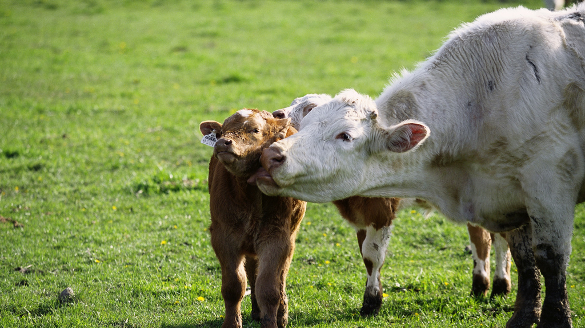

# Livestock Management

This is the website about the livestock management system. 

## Section 1
Since I haven't figured out how to show and use the website yet, this is my temporary description >.<

## Section 2
**There should be some sentences.**
### (Optional) Subsection 1
*N/A*
### (Optional) Subsection 2
No ideas

## See also
If you want to see more about how the Geoinfomatics are used in Livestock Management, the following resources are useful for you.
- [Resource 1](https://www.gjoee.org/papers/874.pdf)
- [Resource 2](https://journal.vetscan.co.in/index.php/vs/article/view/111)

## References
1. Amin, A., Shah, K.A. and Andrabi, A. (2012). *Use of geoinformatics in livestock disease management.* Vetscan 7(1) : Pp. 1-5.
2. Bhabhor I. N. and Vyas H. U. (2018). Guj. J. Ext. Edu. *ROLE OF GEOINFORMATICS IN ANIMAL HUSBANDRY.* Special Issue on National Seminar: April 2018.